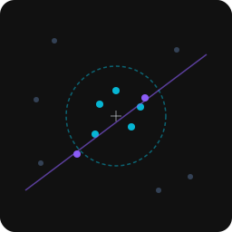

<p align="center">
  
</p>

<h1 align="center">@gridworkjs/query</h1>

<p align="center">Higher-level spatial queries against any gridwork index</p>

## Install

```
npm install @gridworkjs/query
```

## Why

Spatial indexes give you `search()` (rectangular intersection) and `nearest()` (k closest items). But real applications need more: circular radius searches, raycasting, containment checks, distance-annotated results, filtered nearest-neighbor. This package provides those queries as standalone functions that work with any gridwork index.

## Usage

Every query function takes a spatial index as its first argument. The index carries its own accessor, so you never pass it twice.

```js
import { radius, knn, ray, within } from '@gridworkjs/query'
import { createQuadtree } from '@gridworkjs/quadtree'
import { point, rect, bounds } from '@gridworkjs/core'

const tree = createQuadtree(entity => bounds(entity.position))
tree.insert({ id: 'player', position: point(100, 200), hp: 80 })
tree.insert({ id: 'enemy-1', position: point(120, 210), hp: 50 })
tree.insert({ id: 'enemy-2', position: point(400, 100), hp: 90 })
tree.insert({ id: 'chest', position: point(105, 195), hp: null })
```

### Radius - "What's near me?"

Find all entities within 50 units of the player. A tower defense game checking which enemies are in range:

```js
const inRange = radius(tree, { x: 100, y: 200 }, 50)
// => [{ item: { id: 'chest', ... }, distance: 7.07 },
//     { item: { id: 'enemy-1', ... }, distance: 22.36 }]

for (const { item, distance } of inRange) {
  if (item.hp != null) dealDamage(item, falloff(distance))
}
```

### KNN - "What's closest?"

Find the 3 nearest items to a point, but only enemies, and only within 200 units. An AI deciding which target to engage:

```js
const targets = knn(tree, { x: 100, y: 200 }, 3, {
  maxDistance: 200,
  filter: item => item.id.startsWith('enemy')
})
// => [{ item: { id: 'enemy-1', ... }, distance: 22.36 }]

const primary = targets[0]?.item
```

### Ray - "What does this line hit?"

Cast a ray from the player toward an enemy. A bullet, a line of sight check, or a laser:

```js
const hits = ray(tree, { x: 100, y: 200 }, { x: 1, y: 0.5 })
// => [{ item: { id: 'chest', ... }, distance: 5.59 },
//     { item: { id: 'enemy-1', ... }, distance: 22.36 }]

const firstHit = hits[0]?.item
```

### Within - "What's fully inside this area?"

Find all entities completely contained in a selection rectangle. A strategy game box-selecting units:

```js
const selected = within(tree, rect(90, 190, 130, 220))
// => [{ id: 'player', ... }, { id: 'chest', ... }, { id: 'enemy-1', ... }]
```

## API

### `radius(index, point, r, options?)`

Find all items within distance `r` of a point. Returns `{ item, distance }[]` sorted by distance ascending.

- `index` - any spatial index implementing the gridwork protocol
- `point` - `{ x, y }` center point
- `r` - search radius (non-negative)
- `options.filter` - optional predicate to filter results

### `knn(index, point, k, options?)`

Find the `k` nearest items to a point with distance annotations. Returns `{ item, distance }[]` sorted by distance ascending.

- `index` - any spatial index implementing the gridwork protocol
- `point` - `{ x, y }` query point
- `k` - number of nearest neighbors (positive integer)
- `options.maxDistance` - exclude items farther than this distance
- `options.filter` - predicate to filter candidates

### `ray(index, origin, direction, options?)`

Cast a ray and find all items it intersects. Returns `{ item, distance }[]` sorted by distance along the ray.

- `index` - any spatial index implementing the gridwork protocol
- `origin` - `{ x, y }` ray starting point
- `direction` - `{ x, y }` direction vector (automatically normalized)
- `options.maxDistance` - maximum ray length

### `within(index, region)`

Find all items fully contained within a region's bounding box. Unlike `search()` which returns items that intersect, `within()` requires complete containment. Returns plain items (no distance annotation).

- `index` - any spatial index implementing the gridwork protocol
- `region` - bounds object, or any gridwork geometry (point, rect, circle). Circles and other geometries are converted to their axis-aligned bounding box

## Works with Any Gridwork Index

These functions accept any object implementing the gridwork spatial index protocol. Use whichever index fits your data:

- `@gridworkjs/quadtree` - dynamic, sparse data
- `@gridworkjs/rtree` - rectangles, bulk loading
- `@gridworkjs/hashgrid` - uniform distributions
- `@gridworkjs/kd` - static point sets

## License

MIT
